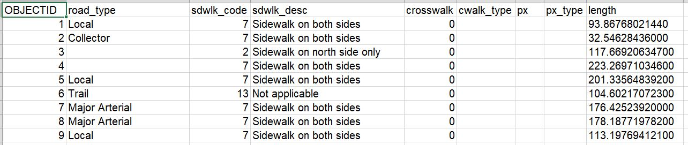

### Toronto Walkability Project
The City of Toronto Walkability Assessment was a collective effort by the Data Analytics and Visualization team (DAV) and Transportation Services. The project aimed to construct and assess a pedestrian walkable network that would be used further to generate an analytical lens for the assessment of walkability across the City of Toronto. The primary purpose of this project was to identify and analyze characteristics across the following domains:
* mode share for walking by census tract,
* walkability,
* economic impact of walkability,
* growth in the City of Toronto,
* vulnerable/social equity lens,
* streetscape quality,
* identify areas/locations for prioritizing pedestrian improvements,
* develop new tools for prioritization for city infrastructure investments & service improvements, and
* develop decision-support system for implementing new projects for minimum sidewalk design standards.

### Data Collection
Data collection took place between August and September 2018. Data analysts examined all available datasets, compiled them into an integrated resource, and undertook an extensive quality assurance and control process consisting of automated and manual checks to ensure the data is suitable for the task at hand.

### Data Preparation
The methodological approach for this study was to create a pedestrian network (based on sidewalk centerlines), assess the inventory of pedestrian-assets (e.g., sidewalks, crosswalks, pedestrian controlled crossings) city-wide, and determine the walkability of various amenities relevant to the lived experiences of residents across the city. The focus was placed on topological consistency over spatial accuracy. Meaning that the sidewalk centerlines are not necessarily spatially located along with the actual locations of the sidewalk geographically, but the connections between different sidewalk segments were maintained as being a higher priority.

In 2018, the Transportation Services Division contracted the vendor iVision to capture sidewalk and pedestrian asset presence. Currently it is the division's intention to have iVision’s data to be the source of truth regarding sidewalk presence, and going forward other groups will maintain or update this pedestrian network from these assets going forward. There are datasets being developed through work with IT and Road Operations within the Transportation Services Division (primarily using iVision data as an initial base) that will also create a pedestrian network (with a focus on maintenance of assets and route planning for inspectors). This will no doubt be useful, however it has yet to be realized fully and so applications surrounding it are envisioned for the longer term. The outputs of this project may be useful in the development of those datasets.

### Walkability
Walkability has been calculated to determine how-walkable a particular area is in relation to pedestrian access to various amenities and socio-demographic characteristics. In Toronto, several communities have lower-walkability when walking to schools. For example, West Humber-Clairville, Humber Summit, Briar Hill-Belgravia, Milliken east, Islington-City Centre West (southern areas), the eastern portion of York University Heights, Clairlea-Birchmount (north), southern parts of West Hill, the eastern part of Dorset Park neighbourhoods, some parts of Waterfront Communities-The Island and Niagara.

### About the Data
This archive contains the final spatial data used for the Toronto Accessibility Analysis project. 

__PEDNET COLUMN DESCRIPTIONS__
* __FID__: unique identifier
* __Shape__: geometry of segment
* __OBJECT_ID__: unique identifier
* __road_type__: segment road type
* __sdwlk_code__: segment sidewalk code
* __sdwlk_desc__: segment sidewalk code description
* __crosswalk__: boolean,crosswalk status
* __cwalk_type__: crosswalk type flag
* __px__: control unique ID number
* __px_type__: crosswalk control flag
* __length__: length of segment

https://github.com/gcc-dav-official-github/dav_cot_walkability/blob/master/Pednet.JPG

### Research Question Definitions ###

### Conclusion and Next Steps ###